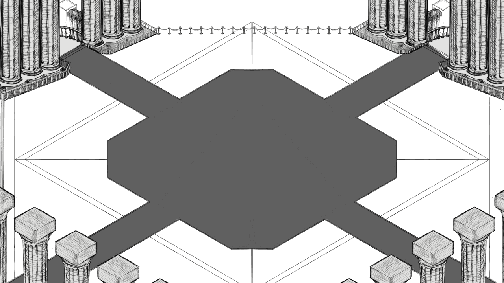

# Ahmar

A top-down action combat prototype in HaxeFlixel, in the style of Hyper Light Drifter: dash through enemies, close-range attacks, stamina and knockback.




<sub>The Dinner Room arena, composited from the three hand-drawn layers in `assets/images/DinnerRoom/`. The player and enemies are still coloured placeholder boxes.</sub>

## What it does

- Eight-direction movement with keyboard, D-pad or left stick
- Dash that costs stamina, passes through enemies and hits and knocks back anything along its path
- Directional basic attack with a short-lived hitbox, knockback and a sound effect
- Enemies that chase the player within range, attack when close and take knockback
- A floating health bar on the player; a stamina bar on a separate UI camera, regenerating over time
- Camera zooms in during combat and eases back out afterwards, clamped to the level bounds
- A 5760x3240 scrolling arena (1920x1080 view) with floor, background and foreground pillar layers

## Play

**Engine:** Haxe with HaxeFlixel and `flixel-addons` (from `Project.xml`).

```bash
haxelib install flixel
haxelib install flixel-addons
lime test html5     # or linux / windows / mac / hl
```

Builds go to `export/`. Mobile builds get an on-screen virtual pad.

**Controls** (from `Player.hx`):

| Input | Action |
|---|---|
| WASD / arrow keys / D-pad / left stick | Move |
| Space | Dash (while moving) |
| Z | Attack |

## Status

Prototype, paused since July 2024. Combat, dash and enemy AI work in a single arena; character sprites exist as concept art in `concept art/` but are not wired in yet. Ideas that are noted but not built: rock-paper-scissors player types with stat modifiers, and post-hit invincibility (`workingBrain.txt`).

## License

MIT. See [LICENSE](LICENSE).

---
<sub>Built by [Aladdin Ali](https://github.com/NaxeCode) · [naxecode.github.io](https://naxecode.github.io)</sub>
